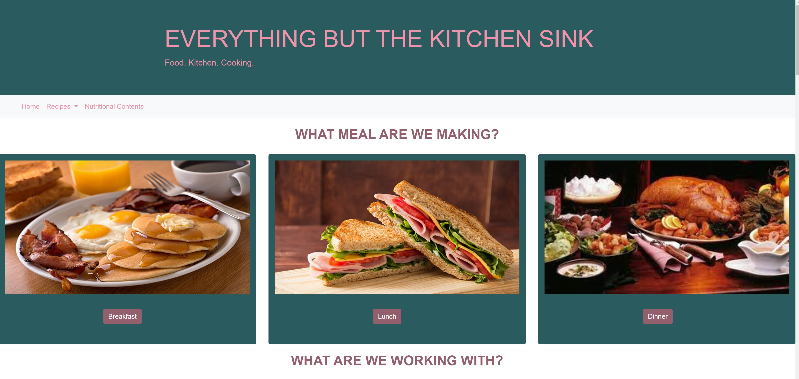
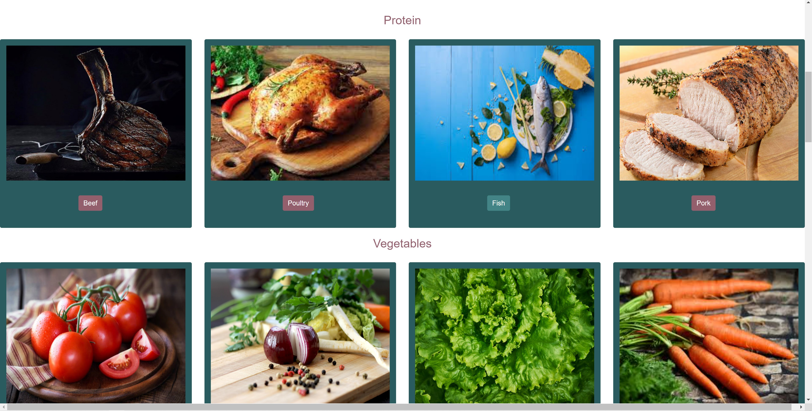
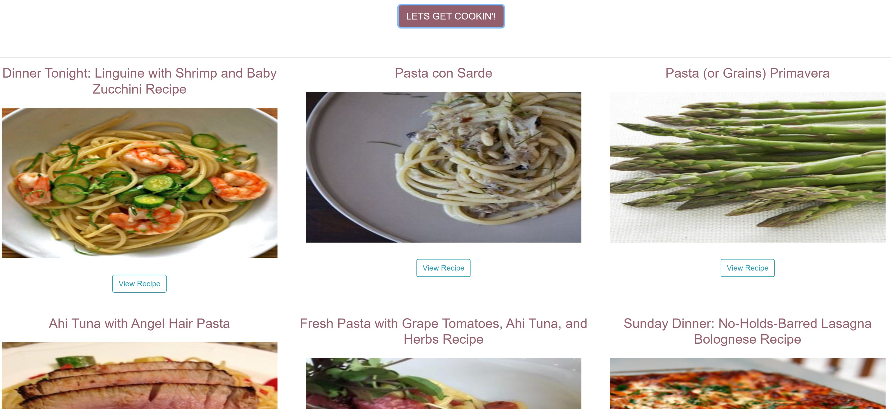

<h1>Everything but the Kitchen Sink</h1>

Our goal with this project is to create an application where users can find recipes using the ingredients they have in their kitchen.

Users will be able to specify what meal they are cooking and then select ingredients that they would like to use in a recipe.

<h2><a href="https://ruxpin86.github.io/home-cooking-app-project-1/">Deployed Application</a></h2>

<h3>Libraries Used</h3>
<ul>
<li><a href="https://www.edamam.com/">Edamam</a></li>
<li><a href="https://calorieninjas.com/api">CalorieNinja</a></li>
</ul>

<h3>Preview</h3>

 

 

<h4>Contributors</h4>
<ul>
<li><a href="https://github.com/ruxpin86">Ted Glynn</a></li>
<li><a href="https://github.com/rrkincaid">Rachel Kincaid</a></li>
<li><a href="https://github.com/SheriB7">Sheri Brown</a></li>
<li><a href="https://github.com/wrenvana">Wren Sanchez</a></li>
</ul>
